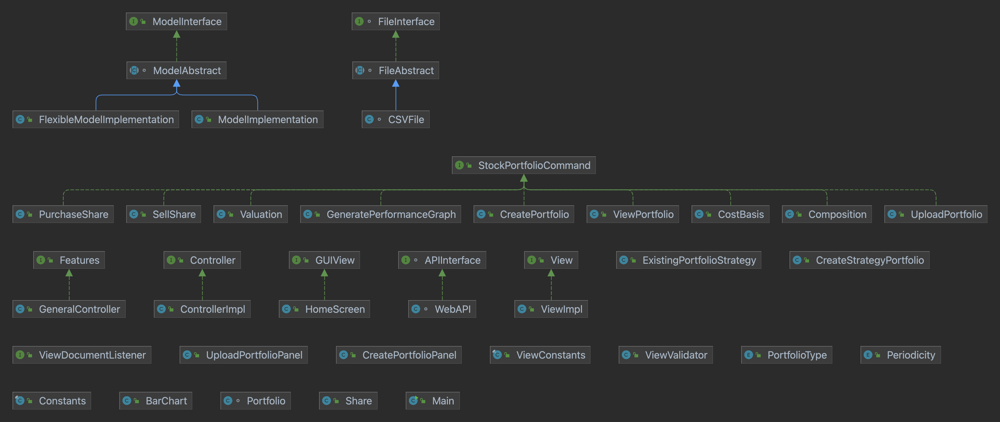

# Design Changes Compared to Last Submission

## Model Changes
- **Introduction of Abstract Class**: Added an abstract class between the model interface and concrete implementation class, moving methods from "ModelImplementation" to this abstract class without any code change. This approach enables code reuse by "FlexibleModelImplementation".
- **Decision Against Inheritance**: Inheritance was avoided due to the potential undesirable effects changes in the parent class could have on child classes, especially if a parent class has multiple child classes in scenarios involving more than one type of portfolio.

## Controller Changes
- **Adoption of Command Design Pattern**: The controller has been updated to the Command Design Pattern, making the code easier to maintain as new functionality and features are added.
- **Switch Case Removal**: The previous design's rapidly expanding switch case has been replaced, making the design more future-proof. The logic from the switch case has been moved to individual command classes.

## General Controller
- **New Feature Interface**: The general controller now implements a feature interface, accommodating both GUI-based and text-based views. This interface simplifies adding new views by implementing the feature interface.

## General Design Overview

### Model Folder (12 Classes)
- **APIInterface**
  - `WebAPI`: Handles web API calls to the ALPHA VANTAGE API.
- **FileInterface**
  - `FileAbstract`: Contains method definitions common to file interface implementations, such as create, write, delete, or clear a file.
    - `CSVFile`: Manages files in CSV format.
- **ModelInterface**
  - `ModelAbstract`: Contains method definitions common to model interface implementations, facilitating operations like portfolio and share object creation and interaction with the File Interface.
    - `ModelImplementation`: Supports functionalities developed in the last assignment.
    - `FlexibleModelImplementation`: Supports functionalities needed by flexible portfolios, such as creating portfolios and buying & selling stocks.

#### Low Level Model Classes
- `Portfolio`: Represents a portfolio with a unique ID, creation date, and associated share objects.
- `Share`: Represents a share with purchase date, company symbol/ticker, purchase price, and number of stocks bought.
- `Periodicity`: An enum class defining possible filters for performance graphs.

### View Folder (Text-based View)
- **View**
  - `ViewImpl`: A view implementation that displays messages based on controller method calls, with no visibility of controller or model implementation.

### GUI Folder
- **GUI View**: Interface for GUI views.
- Various classes for different view functionalities and tabs.
- `ViewValidator`: A generalized validation file for views.

### Controller Folder
- **Controller**
  - `ControllerImpl`: Implements controller interface, handling input from an InputStream object and output to a PrintStream object, interacting with the model based on user input.
- **Features**
  - `GeneralController`: Designed for implementing GUI View, dynamically assigns action listeners in the view based on features from the interface.

## UML Diagram Analysis and Design Patterns
The UML diagram shows a sophisticated use of design patterns that shape the architecture of the system:

### Model Layer
- Utilizes a **Template Method** pattern through `ModelAbstract`, which defines the skeleton of the operations, leaving the details to be implemented by its subclasses.
- Implements a **Strategy** pattern via `FileInterface` and `FileAbstract`, allowing different file operation strategies to be used interchangeably.

### Controller Layer
- The **Command** pattern is employed through the `StockPortfolioCommand` interface, with various commands encapsulating the actions.

### View Layer
- A **Bridge** pattern is used by the `View` interface, decoupling the view's abstraction from its implementation.
- The `ViewValidator` class represents a **Facade** pattern, providing a simplified interface for complex view validation logic.

### GUI Components
- GUI components such as `HomeScreen` and various panel classes correspond to different screens or components in the GUI, organized to facilitate user interaction.

### Enumerations
- Enumerations like `PortfolioType` and `Periodicity` standardize types and constants, ensuring consistency across the model.

