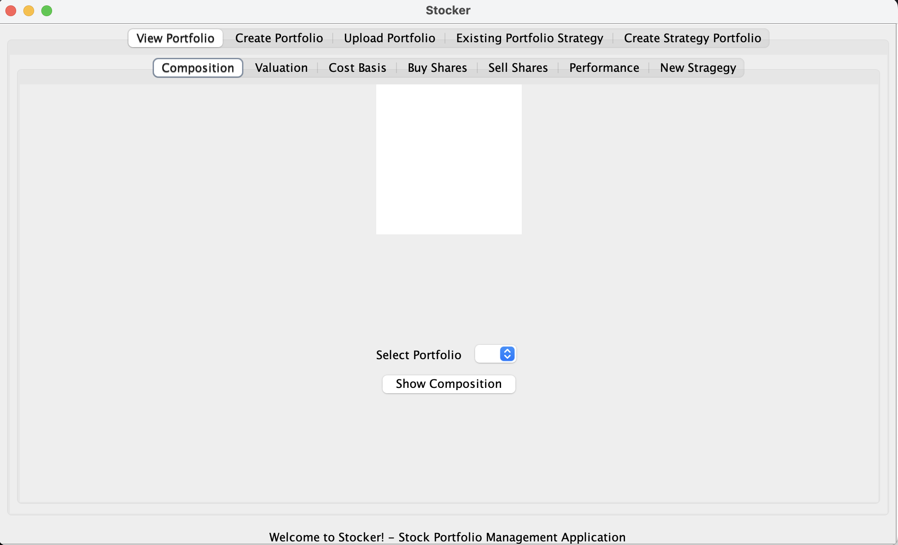

# Stocker: Quantitative Investment Strategies Platform

Stocker is a versatile stock portfolio management tool that allows users to create, upload, and manage their stock portfolios with a range of features including portfolio valuation, cost basis calculations, and performance tracking over time.



## Features

- **Create Portfolio:** Users can create two types of portfolios:
  - **Fixed Portfolio:** A static portfolio that cannot be modified post-creation.
  - **Flexible Portfolio:** A dynamic portfolio that allows modifications, including adding and selling shares after creation.
  
- **Upload Portfolio:** Users can upload their own portfolio using:
  - **Absolute Path:** Specify the absolute file path from the user's system.
  - **Relative Path:** Specify a path relative to the application's directory.

- **View Portfolio:** This feature displays all portfolios and allows users to:
  - View the composition of a portfolio.
  - Get the valuation of a portfolio on a specific date.
  - Calculate the cost basis of a portfolio up to a specific date.
  - Buy or sell shares.
  - Track the performance of the portfolio over time.

- **Existing Portfolio Strategy:** Apply dollar-cost averaging strategy to existing flexible portfolios.

- **Create Strategy Portfolio:** Create a new portfolio with a dollar-cost averaging strategy, assigning weights to different stocks.

## Setup Instructions

1. Unzip the submitted file and copy the JAR file to a desired location within an empty folder.
2. Open a terminal or command prompt in the folder containing the JAR file.
3. Execute the following commands:
   ```shell
   jar tf pdp.jar
   jar xf pdp.jar stocker
   java -jar pdp.jar
   ```
4. Follow the on-screen prompts to manage your portfolios. 

## Usage Example

### Creating and Managing Portfolios

- **To create a new portfolio:**
  1. Choose to create a Fixed or Flexible Portfolio.
  2. Add shares to the portfolio by entering the company name, the number of shares, and the date of purchase.
  3. Finalize the portfolio by providing a unique name.

- **To upload a portfolio:**
  1. Select 'Upload Portfolio' from the start menu.
  2. Provide the relative path to the `.csv` file containing the portfolio data.

### Viewing and Managing Portfolios

- **To view and manage portfolios:**
  1. Select 'View Portfolio' from the start menu.
  2. Choose a portfolio by its name.
  3. Select an action (e.g., buy shares, sell shares, view composition).

### Valuation and Performance

- **To calculate the valuation of a portfolio:**
  1. From the 'View Portfolio Menu', select 'Valuation of Portfolio on a specific date'.
  2. Provide the date for which you want to value the portfolio.

- **To track the performance of a portfolio over time:**
  1. From the 'View Portfolio Menu', select 'Performance of portfolio over time'.
  2. The application will display the portfolio's performance graph.

## Design and Architecture

The application follows a modular design with a clear separation between the Model, View, and Controller (MVC) components. It includes support for both text-based and GUI interactions, allowing users to work with the tool in a manner best suited to their preferences.

- **Model:** Handles all data-related logic, including API interactions and file I/O operations.
  - The `ModelInterface` hides low-level operations and is the single point of interaction for the controller.
  - `ModelAbstract` contains common method definitions used by concrete implementations like portfolio and share management.
  - `FlexibleModelImplementation` caters to dynamic portfolios allowing modifications post-creation.
- **View:** Manages the user interface and interactions, including display messages and user prompts.
  - `ViewImpl` for text-based interactions displays messages based on controller inputs.
  - `GUIView` interfaces and panels manage GUI components for a richer user experience.
- **Controller:** Acts as the intermediary between the Model and View, controlling the flow of data and responses.
  - `ControllerImpl` manages inputs and outputs, interacting with the model based on user commands.
  - The `Features` interface and `GeneralController` facilitate the addition of new text-based or GUI views.

For a detailed explanation of the design changes and architecture, refer to the `DESIGN-README.md` included in the codebase.

## Additional Information

The application includes support for the AlphaVantage API and can handle all ticker symbols reported by the API. Commission fees are accounted for each transaction. For a complete list of functionalities and their status, refer to the `questionnaire.txt` provided with the code.


